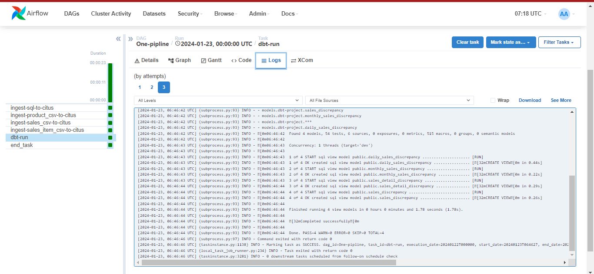
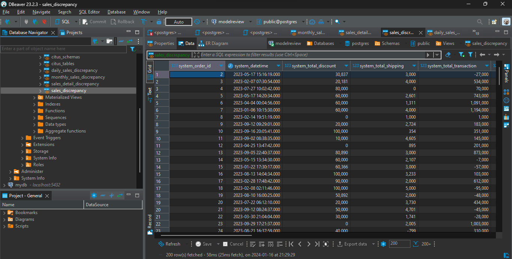
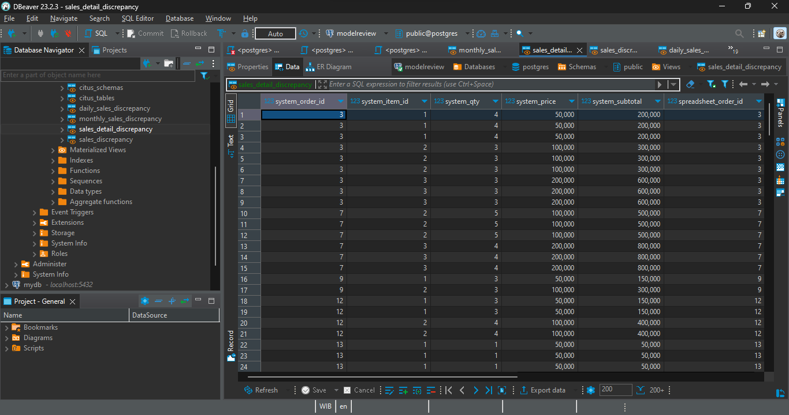
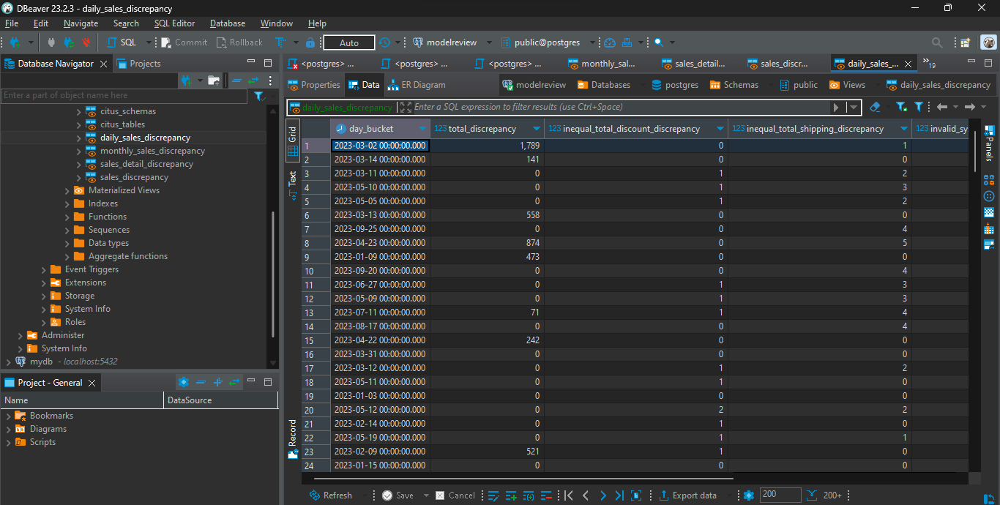
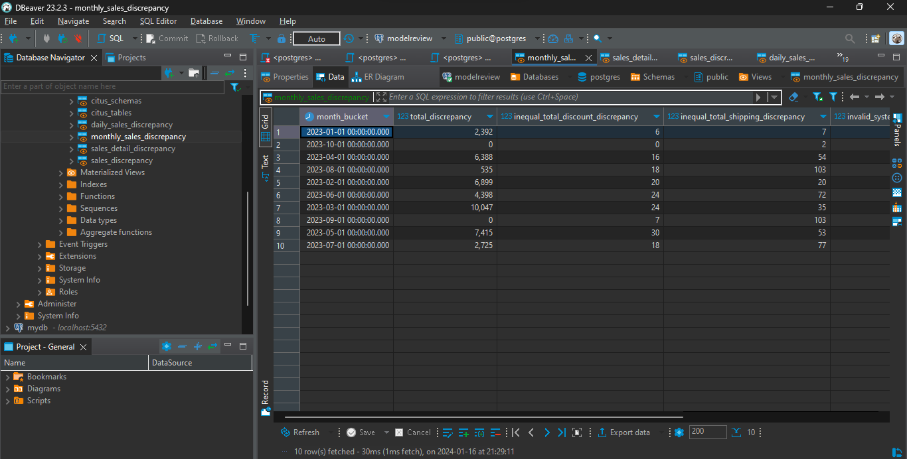

# ERP vs Spreadsheet Sales Discrepancy: an Airbyte / dbt / Airflow ELT Pipeline

[](https://github.com/batukkilat/ERP-ELT-Discrepancy/actions/workflows/ci.yml)

An end-to-end ELT pipeline that quantifies where a newly adopted ERP system disagrees with the
spreadsheet bookkeeping it replaced. Data is ingested from two independent sources with
Airbyte, landed in a Citus/Postgres warehouse, modelled into four discrepancy tables with dbt,
and orchestrated daily by Airflow.

*Bahasa Indonesia: dokumentasi ini sebelumnya ditulis dalam Bahasa Indonesia. Versi Inggris di
bawah adalah versi utama.*

---

## Problem

A company that had always tracked sales in spreadsheets migrated to an ERP system. During the
transition both systems ran in parallel, which raises the question the business actually cares
about: **do the two agree, and if not, where and by how much?**

Answering it lets stakeholders decide:

- whether the ERP is working well enough to replace spreadsheet bookkeeping outright
- which standard operating procedures need correcting
- whether ERP data is trustworthy enough to drive analysis
- whether fixes to the ERP and to the SOPs reduce total discrepancy, or increase it

The engineering constraint is that the two sources are structurally different. One is a
relational database, the other a set of CSV exports, and they must be reconciled without
either being treated as authoritative.

## Architecture

```
  ERP (Postgres) ──┐
                   ├──> Airbyte ──> Citus warehouse ──> dbt models ──> discrepancy tables
  Spreadsheet(CSV) ┘                                          ▲
                                                              │
                                              Airflow DAG (daily schedule)
```

| Layer | Tool |
|---|---|
| Ingestion | Airbyte |
| Warehouse | Citus on PostgreSQL |
| Transformation | dbt (`dbt-core` 1.7.4) |
| Orchestration | Airflow |
| Visualisation | Looker Studio |

## Data model

Four dbt models, each materialised as a table in its own schema, compare the ERP side against
the spreadsheet side at a different grain:

| Model | Grain | Answers |
|---|---|---|
| `sales_discrepancy` | Per line item | Which individual rows disagree |
| `sales_detail_discrepancy` | Per line item, with quantities and prices | Where in the line the disagreement originates |
| `daily_sales_discrepancy` | Per day | How much total value diverges each day |
| `monthly_sales_discrepancy` | Per month | Whether divergence is trending up or down |

The daily and monthly models do more than sum a difference. They separate the *kinds* of
disagreement, which is what makes the output actionable:

```sql
SELECT
    DATE_TRUNC('day', COALESCE(system_datetime, spreadsheet_datetime)) AS day_bucket,
    SUM(ABS(COALESCE(system_total_transaction, 0)
          - COALESCE(spreadsheet_total_transaction, 0)))          AS total_discrepancy,
    SUM(CASE WHEN system_total_discount <> spreadsheet_total_discount
             THEN 1 ELSE 0 END)                                    AS inequal_total_discount_discrepancy,
    SUM(CASE WHEN system_total_shipping <> spreadsheet_total_shipping
             THEN 1 ELSE 0 END)                                    AS inequal_total_shipping_discrepancy,
    SUM(CASE WHEN system_total_transaction <> spreadsheet_total_transaction
             THEN 1 ELSE 0 END)                                    AS invalid_system_calculation_discrepancy
FROM daily_sales_comparison
GROUP BY 1
```

A discount mismatch and a shipping mismatch point at different root causes, so counting them
separately tells the business which SOP to fix rather than only that something is wrong.

## Data quality tests

Sources are declared in `airflow-dag/dbt-project/models/store/schema.yml` with dbt tests
attached, so a structural problem fails the run rather than silently producing a wrong
discrepancy figure:

- `unique` and `not_null` on every primary key (`sales_id`, `product_id`)
- `not_null` on the measures the comparison depends on (`total_transaction`, `qty`, `price`, `subtotal`)
- `relationships` tests enforcing that every `sales_item` row references a real sale and a real product, on both the ERP side and the CSV side

This matters for a reconciliation job specifically. If a foreign key is broken on one side, the
join silently drops rows and the discrepancy total comes out *lower* than reality, which is the
most dangerous possible failure for this use case.

## Orchestration

`airflow-dag/Pipeline.py` defines a daily DAG. Four Airbyte syncs run in parallel, all of them
gate the dbt run, and the dbt run gates completion:

```
ingest-sql-to-citus            ┐
ingest-product_csv-to-citus    ├──> dbt-run ──> end_task
ingest-sales_csv-to-citus      │
ingest-sales_item_csv-to-citus ┘
```

Syncs are triggered with `AirbyteTriggerSyncOperator` in synchronous mode so the transform
cannot start against a half-loaded warehouse. Retries are set to 1 with a 5 minute delay.

## Repository layout

```
airflow-dag/
  Pipeline.py                    the daily DAG (ingest -> dbt run)
  ingest_erp.py                  ingestion DAG
  dbt-project/
    dbt_project.yml              model-to-schema configuration
    packages.yml                 dbt package dependencies
    models/
      store/schema.yml           source declarations + data quality tests
      sales_discrepancy/
      sales_detail_discrepancy/
      daily_sales_discrepancy/
      monthly_sales_discrepancy/
docker/docker-compose.yaml       Postgres, Citus, Airbyte, Airflow
ddl.sql                          source schema
products.sql, sales.sql, sales_item.sql   seed data
products.csv, sales.csv, sales_item.csv   spreadsheet-side source
IMG/                             screenshots of each pipeline stage
```

## Running it

**1. Bring up the stack**

```bash
docker compose -f docker/docker-compose.yaml up -d
```

**2. Load the source data**

Connect to Postgres on port `5432`, run `ddl.sql` to create the tables, then load
`products.sql`, `sales.sql` and `sales_item.sql`.

**3. Configure Airbyte**

Open the Airbyte UI and create a connection from Postgres (`5432`) to Citus (`15432`), then
repeat for the CSV sources. Credentials come from your `.env`; do not commit them.

Verify the data landed:

```bash
docker exec -it citus bash
psql -U postgres -c '\dt'
```

**4. Configure dbt**

```bash
pip install dbt-core==1.7.4
cd airflow-dag/dbt-profiles
export DBT_PROFILES_DIR=$(pwd)
```

`profiles.yml` targets Citus on `host.docker.internal:15432`. Supply the credentials through
environment variables rather than hardcoding them.

**5. Run**

```bash
cd airflow-dag/dbt-project
dbt test    # validate sources before transforming
dbt run     # build the four discrepancy models
```

**6. Schedule**

Open Airflow, create the `airbyte_conn` and Citus connections, then enable the `One-pipeline`
DAG.

## Results



| | |
|---|---|
| Sales discrepancy |  |
| Sales detail discrepancy |  |
| Daily sales discrepancy |  |
| Monthly sales discrepancy |  |

A [Looker Studio dashboard](https://lookerstudio.google.com/s/vsj2ohZ8B78) presents the trend
to stakeholders.

## Notes

Credentials are supplied through environment variables and `.env`, which is git-ignored. The
warehouse data directories are runtime bind-mount targets and are ignored as well, since
committing a Postgres data directory exposes `pg_authid` and the table heap files.

## License

[MIT](LICENSE)
